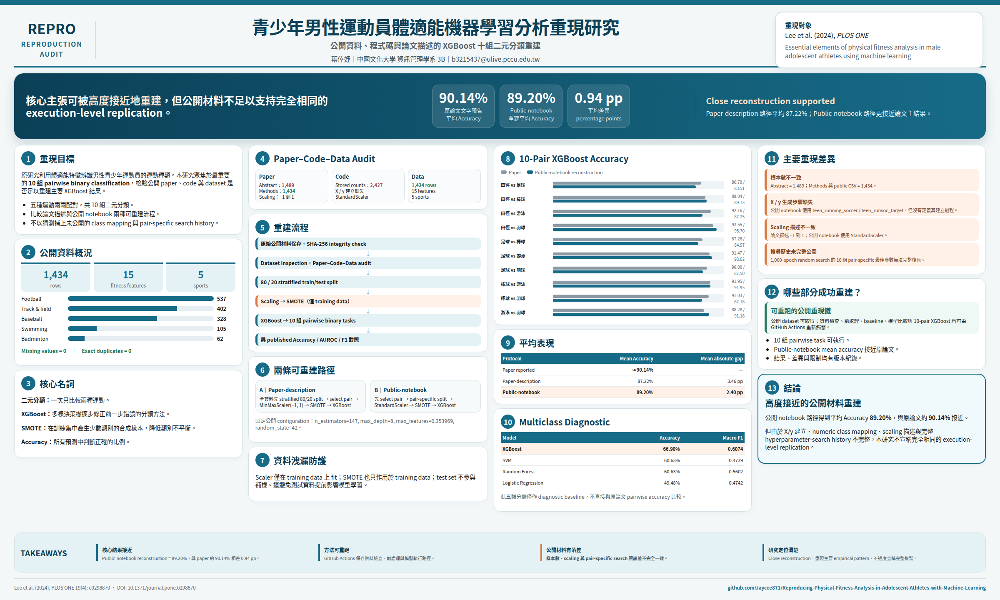

# 青少年男性運動員體適能機器學習分析重現研究

本 Repository 重現 Lee et al. (2024) 發表於 *PLOS ONE* 的研究：

> **Essential elements of physical fitness analysis in male adolescent athletes using machine learning**

本專案以公開論文、公開 GitHub notebook 與公開 dataset 為基礎，建立一套可以在 GitHub Actions 中重新執行、留下紀錄並檢查差異的研究重現流程。

## 中文重現海報

<p align="center">
  
</p>

海報作者：**葉倖妤｜中國文化大學 資訊管理學系 3B｜b3215437@ulive.pccu.edu.tw**

海報採用與 ICML 2026 Agent Reproduction Challenge 類似的 evidence-board 結構，完整原始檔與 self-contained embed 位於 [`reproduction/poster/`](reproduction/poster/)。

## 重現狀態

**核心重現流程已完成。**

目前已完成：

- 原始研究材料保存與 SHA-256 integrity check
- Dataset Inspection
- Paper–Code–Data Consistency Audit
- Preprocessing Reconstruction Audit
- Logistic Regression baseline
- Logistic Regression / SVM / Random Forest / XGBoost 比較
- 原論文 10-Pair Binary XGBoost Reproduction
- Paper-description 與 Public-notebook protocol 比較
- Final Reproduction Summary

## 最重要結果

原論文的主要 XGBoost 結果來自五種運動兩兩配對，共 **10 個 binary classification tasks**。

| Result | Mean Accuracy |
|---|---:|
| Paper reported | 約 **90.14%** |
| Paper-description reconstruction | **87.22%** |
| Public-notebook reconstruction | **89.20%** |

在目前公開材料可支援的固定 XGBoost configuration 下，Public-notebook reconstruction 與論文報告結果的平均差距約為 **0.94 percentage points**。

完整結果請見：

**[Final Reproduction Summary](notes/final_reproduction_summary.md)**

## 公開資料

本專案保存的公開 dataset 包含：

- **1,434** rows
- **16** columns
- **15** physical-fitness features
- Target：`sports types`

五種運動：

- football
- track & field
- baseball
- swimming
- badminton

資料檢查結果：

- Missing values：0
- Exact duplicate rows：0

## 重現流程

```text
Original public materials
        ↓
Source inventory + SHA-256
        ↓
Dataset inspection
        ↓
Paper–Code–Data audit
        ↓
Preprocessing reconstruction
        ↓
Multiclass diagnostic baseline
        ↓
Classical model comparison
        ↓
10-pair binary XGBoost reproduction
        ↓
Final reproduction summary
```

## GitHub 自動化

主要步驟皆可由 **GitHub Actions** 手動執行：

- Fetch original research materials
- Dataset inspection
- Paper code data audit
- Preprocessing reconstruction audit
- Logistic regression baseline
- Classical model comparison
- XGBoost 10-pair binary reproduction

因此不需要依賴特定個人電腦環境即可重新觸發主要分析流程。

## Paper–Code–Data Audit 發現

公開材料之間存在幾個需要保留的 reproducibility findings：

1. 論文摘要寫 **1,489** 名運動員，但 Methods 與公開 CSV 為 **1,434**
2. 公開 notebook 保存的五類 class counts 總和為 **2,427**
3. notebook 使用 `teen_running_soccer` 與 `teen_runsoc_target`，但沒有公開其建立過程
4. 原 numeric class mapping 未公開
5. 論文描述 scaling 到 **-1 到 1**，公開 notebook 使用 **StandardScaler**
6. 完整的 10-pair、1,000-epoch random hyperparameter-search history 無法從公開材料完整復原

這些差異均保留於 audit 文件，不以猜測方式補齊。

## Multiclass Diagnostic Comparison

| Model | Accuracy | Macro F1 |
|---|---:|---:|
| XGBoost | **66.90%** | **0.6074** |
| SVM | 60.63% | 0.4739 |
| Random Forest | 60.63% | 0.5602 |
| Logistic Regression | 49.48% | 0.4742 |

此 multiclass 結果僅作 diagnostic baseline，不直接與原論文 10-pair binary accuracy 比較。

## 10-Pair XGBoost Reproduction

本專案測試兩種可由公開材料合理重建的 preprocessing protocol：

### Paper-description protocol

```text
global stratified 80/20 split
→ select pair
→ MinMaxScaler(-1, 1)
→ SMOTE
→ XGBoost
```

平均 accuracy：**87.22%**

### Public-notebook protocol

```text
select pair
→ stratified 80/20 split
→ StandardScaler
→ SMOTE
→ XGBoost
```

平均 accuracy：**89.20%**

完整 10 組結果：

**[10-Pair Binary XGBoost Reproduction](notes/xgboost_10pair_reproduction.md)**

## 重要重現邊界

本專案沒有宣稱完全復原原作者未公開的 pipeline。

10 組 pairwise XGBoost 使用的是公開 notebook 中最後可見的固定 configuration：

- n_estimators = 147
- max_depth = 8
- max_features = 0.353969
- random_state = 42

原論文提及 1,000-epoch random search，但公開材料不足以完整還原每一組 pair 的最佳 hyperparameters。

因此本專案的結論應理解為：

> **a close reconstruction from publicly available materials, rather than an exact execution-level replication of the authors' original pipeline.**

## Repository 結構

```text
original/
  implementation.ipynb
  sports datasets.csv

reproduction/
  inspect_dataset.py
  audit_paper_code_data.py
  reconstruct_preprocessing.py
  run_logistic_baseline.py
  run_classical_model_comparison.py
  run_10pair_xgboost.py
  results/

presentation/
  青少年運動員體適能ML重現研究.pptx
  README.md

notes/
  source_inventory.md
  dataset_inspection.md
  paper_code_data_audit.md
  preprocessing_reconstruction.md
  logistic_regression_baseline.md
  classical_model_comparison.md
  xgboost_10pair_reproduction.md
  final_reproduction_summary.md

.github/workflows/
  ...
```

## 原始研究

**Lee, Y.-H., Chang, J., Lee, J.-E., Jung, Y.-S., Lee, D., & Lee, H.-S. (2024).**  
*Essential elements of physical fitness analysis in male adolescent athletes using machine learning.*  
PLOS ONE, 19(4), e0298870.

DOI: https://doi.org/10.1371/journal.pone.0298870

原作者公開程式碼：

https://github.com/YunhwanJacobLee/Essential-elements-of-physical-fitness-analysis

## 專案定位

本 Repository 為學術研究重現專案。原始研究、資料與程式碼之著作權與授權條款仍屬原作者及原始來源。

本專案新增內容主要為 reproducibility audit、automated GitHub workflow、reconstructed preprocessing、model comparison 與結果紀錄。
